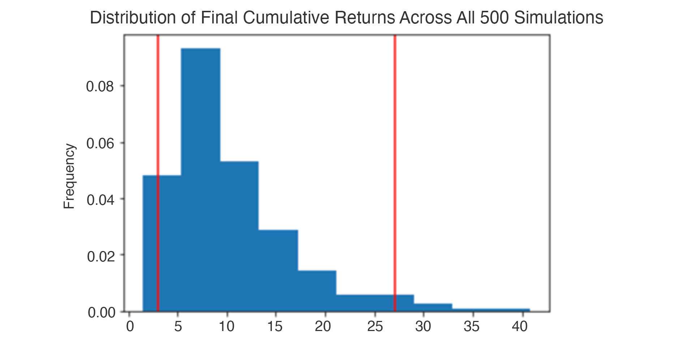

# FinTech-Module-5-Challenge: Financial analysis tools
## This application consists of 2 parts:
A financial planner for emergencies: The members will be able to use this tool to visualize their current savings. The members can then determine if they have enough reserves for an emergency fund.

A financial planner for retirement: This tool will forecast the performance of their retirement portfolio in 30 years. To do this, the tool will make an Alpaca API call via the Alpaca SDK to get historical price data for use in Monte Carlo simulations.


This is a python command-line interface application that uses the information from the Monte Carlo simulation to answer questions about the portfolio.

---
## Usage

To use this application, simply clone the repository and open jupyter lab from git bash by running the following command:

```python
jupyter lab
```

Upon launching the application in Jupyter lab notebook, run the file by using the run button on the top of the notepad.


---
## Steps to create Monte Carlo Simulation

### Create the Monte Carlo Simulation
Make an API call via the Alpaca SDK to get 10 years of historical closing prices for a traditional 60/40 portfolio split: 60% stocks (SPY) and 40% bonds (AGG).

Run a Monte Carlo simulation of 500 samples and 30 years for the 60/40 portfolio, and then plot the results. The following image shows the overlay line plot resulting from a simulation with these characteristics. However, because a random number generator is used to run each live Monte Carlo simulation, your image will differ slightly from this exact image:

Plot the probability distribution of the Monte Carlo simulation. The following image shows the histogram plot resulting from a simulation with these characteristics. However, because a random number generator is used to run each live Monte Carlo simulation, your image will differ slightly from this exact image:




---

## Contributors

Brought to you by PriyaS.

---
